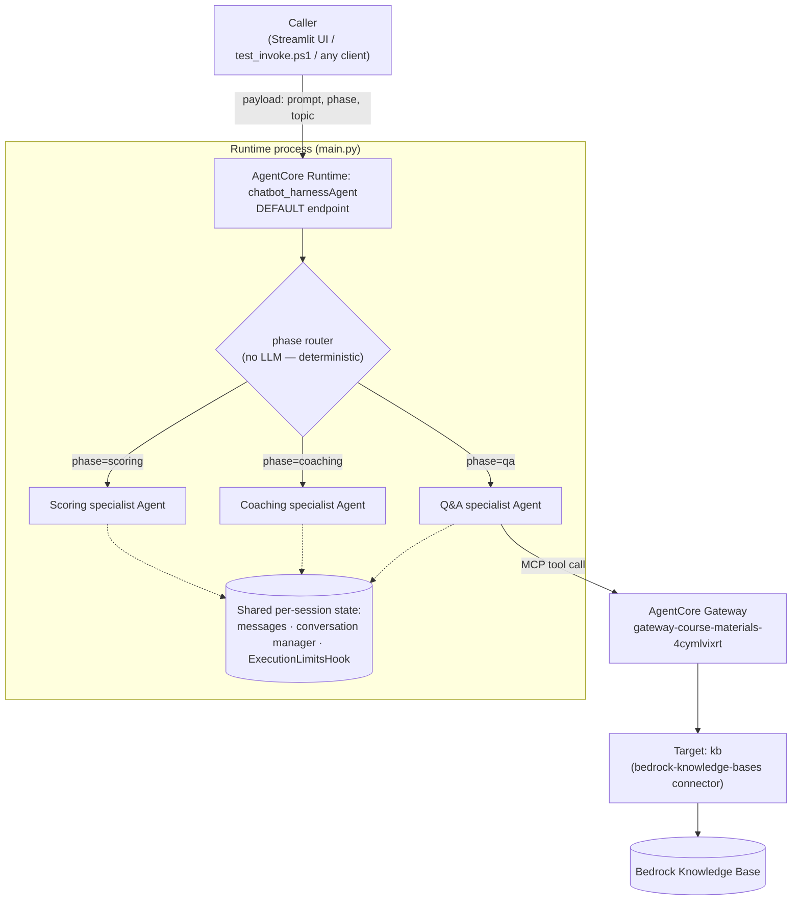

# NUS-Codesign-Chatbot

A Socratic design-thinking coaching chatbot for NUS course design modules. Students describe
their design work; the bot probes with questions rather than giving answers, periodically
switches into a critique mode, and can answer course-logistics questions from official course
materials.

## Two tracks in this repo

| | Root (`main.py`, `phases.py`, ...) | `NUSCodesignChatbot/` |
| --- | --- | --- |
| Status | Original POC | Active development target |
| Stack | FastAPI + raw `boto3` Bedrock `Converse`, Streamlit UI | Amazon Bedrock AgentCore (Strands agent), deployed via CDK |
| Tools / RAG | None — framework text pasted directly into prompts | Real RAG via an AgentCore Gateway → Bedrock Knowledge Base |
| Phases | 5 design-thinking stages (problem ID → concept gen → design spec → ethics → reflection), single agent | 3 specialist agents (Q&A, coaching, scoring), deterministic backend-driven routing |
| Persistence | Local JSON file (`storage.py`) | AgentCore Runtime session history (in-process, per session, best-effort) |
| Docs | [README_1.md](README_1.md) (deploy walkthrough), [FEATURES.md](FEATURES.md) | [NUSCodesignChatbot/AGENTS.md](NUSCodesignChatbot/AGENTS.md), architecture below |

The root POC established the coaching prompt design — assumption-checking, staged Socratic
questioning, the silent AT-EAI ethics scaffold, and critique mode — which was ported into the
AgentCore project's `coaching` specialist. New work happens in `NUSCodesignChatbot/`.

### Root POC quickstart

```bash
python -m venv .venv
.venv\Scripts\Activate.ps1
pip install -r requirements.txt
uvicorn main:app --reload --port 8000     # terminal 1
streamlit run streamlit_app.py            # terminal 2
```

See [README_1.md](README_1.md) for the full deploy walkthrough (Lambda + Function URL) and
[FEATURES.md](FEATURES.md) for what's implemented vs. deferred.

## AgentCore architecture (`NUSCodesignChatbot/`)



### Components

**1. Gateway — `gateway-course-materials-4cymlvixrt`**
- MCP gateway exposing a Bedrock Knowledge Base as callable tools, reached from the Runtime over
  AWS IAM (`outboundAuth: awsIam` in `agentcore.json`) rather than a static API key.
- One target, named **`kb`**. It was originally named `kb-target`, but AWS derives each tool's
  name as `{gateway}_{target}___{operation}` — with `kb-target`, the `AgenticRetrieveStream`
  tool came out to 69 characters against a 64-character limit, so the target was renamed to fit.
- Target type: `bedrock-knowledge-bases` connector, exposing `Retrieve` and
  `AgenticRetrieveStream` operations, backed by knowledge base `JUQNP8AZAZ`.
- **Known issue:** querying it currently returns CDE2300 content, not CDE2500 — worth checking
  the knowledge base's data source before this is used with CDE2500 students.

**2. Runtime — `chatbot_harnessAgent`** (`app/chatbot_harnessAgent/`)
- The actively-developed piece: a Strands agent exported via `agentcore export harness`,
  deployed as a CodeZip AgentCore Runtime (Python 3.14).
- `main.py`'s `invoke()` entrypoint reads `payload["phase"]` (default `qa`) and
  `payload["topic"]` and builds one of three specialist `Agent` instances **per turn** — there
  is no LLM-based router; phase transitions are decided entirely by the caller.
- `phases.py` holds the three specialists' system prompts:
  - **`qa`** — must call the knowledge-base tool before answering course-content questions;
    explicitly refuses to guess when the tool returns nothing relevant.
  - **`coaching`** — the 5-topic Socratic scaffold ported from the POC (`problem_identification`,
    `concept_generation`, `design_specification`, `ethics_critical`, `reflection`), selected via
    `payload["topic"]`. Silent assumption-checking and AT-EAI ethics-checking run every turn; one
    question per turn, never gives answers.
  - **`scoring`** — produces a `**Strengths:** / **To develop:**` critique of the conversation
    so far.
- Only the `qa` specialist is given the knowledge-base gateway tool; `coaching` and `scoring`
  reason over conversation history alone.
- Session state (`messages` history, `SlidingWindowConversationManager`, `ExecutionLimitsHook`)
  is cached per `session_id` (LRU, capped at 128 sessions, in-process — resets on cold start) and
  **shared across phase switches**, so moving `qa` → `coaching` → `scoring` within one session
  keeps full context under a single session-wide 75-iteration / 1-hour execution cap, rather than
  resetting per phase.
- The generic `shell` / `file_operations` tools that AgentCore's export scaffold adds by default
  were deliberately removed — a student-facing course bot shouldn't have arbitrary shell/file
  access on the server.

**3. Harness — `NUSCodesignChatbot`** (`app/NUSCodesignChatbot/`)
- A second resource declared in `agentcore.json` (`harnesses` array), deployed alongside the
  Runtime above.
- Currently a placeholder (`system-prompt.md` = "You are a helpful assistant") — not wired up to
  the phase logic. Not the active bot.

**4. A separate harness exists outside this repo**
- AWS currently also has a harness named `chatbot_harness` (id suffix `M6wbSQc3V9`) with a real
  CDE2500 system prompt and its own backing Runtime — **not represented anywhere in this repo's
  `agentcore.json` or CDK**, meaning it was created directly (console or otherwise) and isn't
  managed by `agentcore deploy` here.
- This is almost certainly the bot currently reachable by students. Until it's imported into this
  project (`agentcore import`) or intentionally retired in favor of the CDK-managed
  `chatbot_harnessAgent` Runtime above, there are two independently-evolving agents for the same
  course — easy to lose track of which one is authoritative.

### Deployment & versioning

- `agentcore deploy` synthesizes and deploys the CDK stack `AgentCore-NUSCodesignChatbot-default`,
  publishing a new Runtime **version** for any code/config change.
- The `DEFAULT` endpoint on a Runtime auto-tracks the latest `READY` version — no manual
  alias/endpoint promotion step, unlike e.g. Lambda aliases.
- Check what's actually live at any time:
  ```powershell
  aws bedrock-agentcore-control list-agent-runtime-endpoints --agent-runtime-id <runtime-id> --region us-west-2
  ```

### Testing

[`NUSCodesignChatbot/test_invoke.ps1`](NUSCodesignChatbot/test_invoke.ps1) invokes the deployed
Runtime directly via `aws bedrock-agentcore invoke-agent-runtime`, bypassing two dead ends: the
`agentcore invoke` CLI only ever sends `{"prompt": "<string>"}` (no room for `phase`/`topic`),
and `agentcore dev`'s local server enforces its own auth that raw HTTP requests can't satisfy.

```powershell
cd NUSCodesignChatbot
.\test_invoke.ps1 -Prompt "When is the final project due?" -Phase qa -SessionId "my-test-session"
.\test_invoke.ps1 -Prompt "Everyone will love a mobile app" -Phase coaching -Topic concept_generation -SessionId "my-test-session"
.\test_invoke.ps1 -Prompt "Score my thinking so far" -Phase scoring -SessionId "my-test-session"
```

Reuse the same `-SessionId` across calls to verify history and the execution-limits cap carry
over between phases; omit it for an isolated one-off test.

### Project structure & CLI reference

See [NUSCodesignChatbot/AGENTS.md](NUSCodesignChatbot/AGENTS.md) for the full `agentcore.json`
schema reference and CLI command list, and [NUSCodesignChatbot/README.md](NUSCodesignChatbot/README.md)
for the AgentCore CLI's generated getting-started guide.
