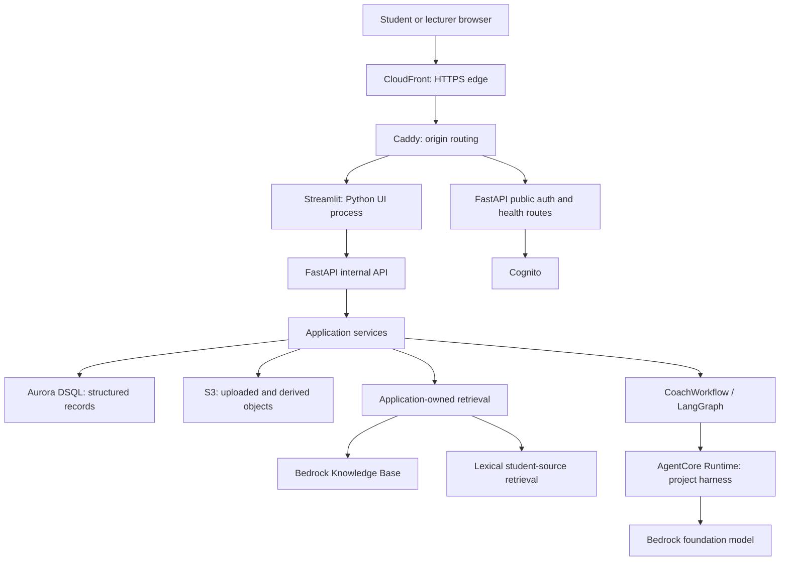

# 1. System and services

[Handbook index](README.md) · [Next: frontend and APIs](02-frontend-api-and-turns.md)

## 1.1 What are we actually building?

The product is a student research notebook with a critical-thinking coach. A student discusses a design problem, attaches evidence, works through a Thinking Path, and receives formative feedback. A lecturer can inspect learning activity and review research observations. The central problem is not simply generating fluent text: the application must preserve who said what, which evidence was available, which phase the student was working on, and whether an action was applied once.

For example, a student investigating unsafe pedestrian crossings might upload interview notes, ask how those notes support an idea, revise an earlier argument, move into Design specification, and later generate a Deep Analysis PDF. These operations must share one coherent notebook history. A refreshed browser should not lose the notebook; a retried request should not produce two student/assistant pairs; revising an earlier claim should not leave future conclusions active as if nothing changed.

The five current phases are Problem identification, Concept generation, Design specification, Ethics & Critical Thinking, and Reflection. The persisted identifier `deep_analysis` names the ethics phase; it is not the same thing as the separate Deep Review operation. Names in older six-stage documents are historical.

## 1.2 The whole system at a glance

The diagram combines network processes and in-process modules. `Application services`, `RAG`, and `CoachWorkflow` are Python components inside FastAPI, not separate servers. Cognito, DSQL, S3, Knowledge Bases, and AgentCore are external services. The application container runs two processes: Streamlit and Uvicorn/FastAPI.

The production topology is defined in [Compose](../../compose.prod.yaml), [Caddyfile](../../Caddyfile), [Dockerfile](../../Dockerfile), and [production startup](../../scripts/start_prod.sh). The documented origin machine is T4g.small EC2 using an ARM64 image. The repository describes that choice; it does not prove which instance is running today.

## 1.3 What each infrastructure service does

| Service | Plain-language role | What this project puts in it | What it does not own |
|---|---|---|---|
| EC2 | A virtual machine that runs the application processes | Docker, Caddy, the app image, private deployment configuration | Canonical student file bytes or transcript storage |
| ECR | A registry for built container images | Versioned application image tagged with a Git SHA | Running Python processes or student notebooks |
| Docker / Compose | Package the software and start related containers | Python dependencies, source, startup scripts, network configuration | A substitute for backups or distributed coordination |
| CloudFront | Public HTTPS entry point and forwarding layer | Distribution/routing configuration | Educational decisions; the app path deliberately disables caching |
| Caddy | Reverse proxy at the EC2 origin | Public auth/health allowlist and routing to Streamlit | Public exposure of every FastAPI route |
| Cognito | Authentication provider | Login identities and token/session authority | Notebook content, course research scores, or application role decisions by itself |
| Aurora DSQL | SQL database for structured application state | Users, notebooks, messages, source metadata, research records, workflow marker | The PDF/image bytes stored in S3 |
| S3 | Object storage: bytes addressed by keys | Raw uploads, extracted text, chunk artifacts, shared course files | The active conversation branch or user authorization policy |
| Bedrock Knowledge Base | Managed retrieval over official course material | An ingested/searchable representation of course content | Personal notebook ownership or automatic permission to cite a returned hit |
| AgentCore Runtime | Hosts and invokes the generation program | The project's published Python harness and prompt assets | Durable chat history or the student-facing UI |
| Bedrock models | Perform language generation and structured assessment | Model invocations with bounded context | Permission to mutate notebook stage or database rows |
| Bedrock Guardrails | Apply configured content controls around generation | Guardrail identifier/version and model-side enforcement configuration | SQL ownership checks or citation authorization |
| IAM | Grants AWS workloads permissions to AWS resources | EC2/runtime role policies and database connection authority | A replacement for notebook-level access checks |
| Logs / CloudWatch integration | Operational evidence | Category, timing, request and model provenance fields | A second transcript store; full private source content should not be logged |

The checked Compose file uses the Docker `json-file` logging driver with rotation. CloudWatch forwarding is an operations integration described by the release documentation; it is not demonstrated merely by finding a logger in Python.

## 1.4 What the frameworks do

**Streamlit** turns Python rendering code into a browser UI. Widget interactions trigger reruns, so the developer must manage session state and rendering boundaries. It makes a research prototype quick to build but requires care for sophisticated chat scrolling and mobile layouts.

**FastAPI** is the HTTP boundary. It accepts requests, resolves identity, validates shapes, calls services, and returns responses. The route handler should not become the place where all educational reasoning lives.

**Uvicorn** is the server that executes the FastAPI ASGI application. FastAPI describes the application; Uvicorn listens on a port and drives it. One worker is configured in the current startup script.

**Pydantic** validates data shapes at boundaries. A string that “looks like JSON” is insufficient: fields, enums, identifiers, and contracts must be accepted by the models. This catches invalid stage identifiers and malformed assessments before they can become durable state.

**LangGraph** supplies the graph execution abstraction in `backend/workflow.py`. It is a library in the application process, not a replacement cloud provider. The current graph has four nodes, explained in chapter 6.

**Strands** supplies the agent/model invocation loop inside the AgentCore harness. The project constrains that loop with schemas, bounded attempts, and no external specialist tools. Calling a Strands object an “Agent” does not mean the whole product is an autonomous multi-agent system.

**psycopg** connects Python to the PostgreSQL-compatible DSQL interface. **boto3/botocore** call AWS APIs. The local database path uses Python's SQLite facilities. These are infrastructure adapters, not domain rules.

Repository package pins are listed in the [reference appendix](REFERENCE.md). The FastAPI image and AgentCore runtime have separate dependency manifests and must be validated separately.

## 1.5 Application service ownership

| Component and entry point | Inputs and outputs | Important responsibility |
|---|---|---|
| [HTTP app factory](../../backend/http/app.py) | HTTP requests → typed responses | Compose dependencies, route ownership, request IDs, error mapping |
| [Auth routes](../../backend/auth_routes.py) and [OIDC client](../../backend/auth_oidc.py) | Login callbacks/cookies → verified identity | State/PKCE, token verification, refresh, logout |
| [WorkspaceService](../../backend/workspace_service.py) | Notebook/source operations → projections | Application-level CRUD and transcript access |
| [CoachApplicationService](../../backend/coaching/execution.py) | Coach request → persisted CoachTurn | Canonical context, reservations, retrieval, provider work, atomic persistence |
| [CoachWorkflow](../../backend/workflow.py) | Authoritative request → assessment/recommendation | Provider-neutral educational workflow and progression normalization |
| [Learning service](../../backend/learning_service.py) | Transition decisions → updated learning state | Explicit state transitions, confirmation compatibility |
| [Source library](../../backend/sources/library.py) | Files/text/URLs/catalog → source records | Import, extraction orchestration, shared catalog projection |
| [Context retriever](../../backend/retrieval.py) | Authorized query/sources → chunks | Composite course/student retrieval and context bounds |
| [StudentStore](../../backend/student_store.py) | Repository operations → SQL rows | Ownership, transactions, revisions, idempotency and research persistence |
| [Storage factory](../../backend/persistence/factory.py) | Settings → storage implementations | Select local/DSQL and local/S3 adapters |
| [Professor analytics](../../backend/professor_analytics/service.py) | Staff-authorized scope → dashboard evidence | Aggregation and lecturer notebook projections |
| [Research package](../../backend/research/__init__.py) | Provisional codes/human reviews → attributable records | Research data contracts and persistence adapter |
| [Context planner](../../backend/context_planner.py) | History/evidence → bounded model context | Keep input within budgets without deleting stored history |
| [Rate limiter](../../backend/rate_limit.py) | Active requests → admission or busy response | Bound local concurrency and per-user request rate |
| [Turn performance](../../backend/turn_perf.py) | Execution milestones → diagnostic events | Explain latency without logging student text |

Compatibility files such as `backend/api.py`, `backend/application.py`, `backend/source_library.py`, and `ui/chat.py` preserve old imports. Follow them to their owning packages before modifying behavior. Their existence does not mean a second implementation is active.

## 1.6 Why layers matter: a simple example

Suppose you replace S3 with a local object store. The Sources panel should still ask for “download this source,” rather than learning bucket names and object-key rules. `FileStorage.get_bytes(key)` is the narrow interface; the adapter decides where those bytes live. Similarly, changing the model should not require rewriting the notebook table.

This is dependency inversion: application code depends on an operation it needs, not on a vendor-specific SDK response. Dependency injection means supplying the concrete implementation when assembling the app. Tests supply deterministic fakes; production supplies AWS adapters.

The separation is useful but incomplete. `StudentStore` still owns many responsibilities, and DSQL reuses substantial store behavior through a compatibility proxy. The application is not a perfectly isolated textbook hexagonal architecture. A credible explanation acknowledges both the existing seams and the remaining coupling.

## 1.7 Why this deployment is reasonable, and its cost

The documented single-machine topology is a reasonable pilot tradeoff: one container image, one public origin, a Python UI, and a backend that can spend much of its time waiting for remote inference. A small ARM machine can host that coordination workload without hosting model weights. These are reasoned advantages, not a claim that the project measured every alternative or proved that instance size sufficient.

The cost is availability and scaling flexibility. One origin machine is a failure point. Streamlit session state and WebSocket connections live in its process. FastAPI's counters and review executors also have process-local state. Moving the durable transcript into DSQL does not automatically make every part of the application stateless.

A useful interview sentence is: “The deployment separates durable learning data from replaceable application containers, while intentionally retaining a single-origin execution model for the pilot.” Chapter 7 explains what must change before adding replicas.

## 1.8 Three identities of a release

The Git commit is the source version. The EC2 image is the packaged FastAPI/Streamlit version. The AgentCore published version is the running generation program. They can differ.

For example, updating `ui/professor.py` requires an application image release. Updating `agentcore_runtime/prompts/fast_chat.md` requires publishing runtime assets. Setting a new DEFAULT runtime version also requires checking session-generation behavior so warm compute does not serve old assets. Merely pushing a commit does not complete either deployment.

The current Compose file hard-codes `AGENTCORE_SESSION_GENERATION: "8"`. A host `.env` value with the same name will not override that explicit Compose `environment` entry. The release checklist's instruction to bump the host variable therefore needs a matching Compose change or override, followed by inspection of the effective configuration. This is an observed configuration/documentation mismatch, not a deployment performed for this guide.
