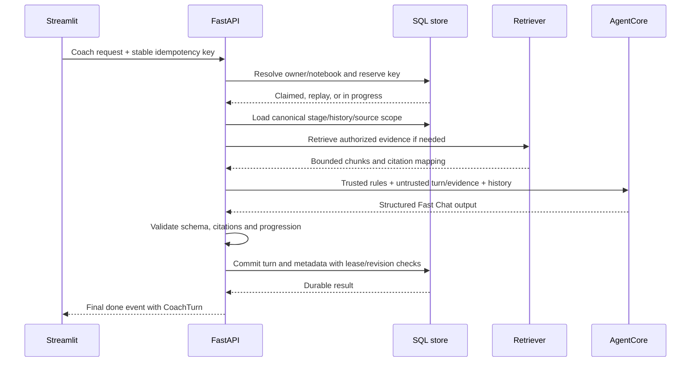

# 2. Frontend, API, and a complete turn

[Handbook index](README.md) · [Next: RAG](03-rag-and-context.md)

## 2.1 Frontend does not mean “everything runs in the browser”

Streamlit rendering code executes in Python on the server. The browser displays the resulting controls and communicates with Streamlit. In production, the Streamlit process calls FastAPI at `http://127.0.0.1:8000`; the browser does not directly call the private coach endpoint through CloudFront.

This distinction explains why Caddy blocks most `/api/*` routes while chat still works. Caddy exposes browser authentication routes and health. The rest of the application API remains accessible to the Streamlit server inside the container.

The frontend entry point is [streamlit_app.py](../../streamlit_app.py). Its meaningful order is authentication, identity binding, staff/student branching, session preparation, theme, and workspace rendering. Staff branch into the lecturer dashboard before student notebook initialization, avoiding accidental student workspace creation during lecturer reads.

## 2.2 UI module map and state

| Module | What the user sees | State to watch |
|---|---|---|
| [workspace.py](../../ui/workspace.py) | Desktop columns and mobile workspace | Which pane is visible, layout mode |
| [panels/nav.py](../../ui/panels/nav.py) | New chat, Search, Library, Recents | Notebook selection, rename/delete dialog state |
| [panels/chat.py](../../ui/panels/chat.py) | Transcript, composer, attachments, edit | Pending draft, request key, streaming status, pagination |
| [panels/sources.py](../../ui/panels/sources.py) | Personal sources and course library | Selection, upload/view dialogs, source refresh |
| [panels/studio.py](../../ui/panels/studio.py) | Thinking Path/Progression and Review | Current stage, Ready state, checkpoint read status |
| [professor.py](../../ui/professor.py) | Roster, activity, notebook workbench, research review | Staff page/tab, selected student and notebook |
| [services/runtime.py](../../ui/services/runtime.py) | No direct visual surface | Owner-scoped facade, API client, rerun helpers |
| [theme.py](../../ui/theme.py) and [styles](../../ui/assets/styles) | Light/Dark/System appearance | CSS cascade and saved preference |
| [layout](../../ui/layout) | Scroll position, composer size, column resizing | Browser DOM observers and event handlers |

There are at least three types of state. Database state is authoritative for messages, source metadata, learning progress, and persisted preferences. `st.session_state` holds current UI interaction state. Browser DOM state holds scroll position, focus, and dimensions. Confusing these causes bugs: changing the visible stage label is not the same thing as saving a stage transition.

The runtime facade directs UI requests to the typed [API client](../../backend/api_client.py). An in-process application-service path remains for local compatibility, but production requires the API path. A panel should not query SQLite or call a model SDK directly.

## 2.3 Why Streamlit reruns were difficult

A normal Streamlit interaction can rerun a Python script. Rerendering an entire chat interface during an in-flight response can reset scrolling, duplicate an apparent workspace, recreate dialogs, or disrupt the composer. The project uses fragments for local updates and full reruns after authoritative application state changes.

For example, changing a small panel control can rerun only that fragment. Completing a persisted chat turn should rerun the app so the durable transcript owns the final bubbles. Changing appearance needs a full rerun because global theme injection happens there. A source poller must avoid triggering a full remount while a turn streams.

Widget keys act like stable identities for controls. Changing them casually can detach stored widget state from the intended control. Browser-side layout helpers exist because Streamlit does not expose all the required scrolling and sizing behavior directly. They are a practical adaptation with a maintenance cost: framework DOM changes can invalidate assumptions.

Recent history is paginated from the newest messages; the implementation-status history records six-message opening windows and upward pagination. The full transcript remains stored. “Only six messages on screen” and “only six recent messages in a model input window” are separate optimizations.

## 2.4 Authentication, step by step

1. The browser opens the public login endpoint.
2. FastAPI creates an expiring OAuth state and PKCE verifier, persisted in `oauth_login_states`.
3. The browser goes to Cognito's login page.
4. Cognito redirects to the configured callback with an authorization code and state.
5. FastAPI validates the callback state and exchanges/verifies credentials through its OIDC adapter.
6. Secure, HttpOnly cookies carry the refresh and ID tokens. The refresh cookie is scoped to `/api/v1/auth`; the ID cookie is available at `/` so Streamlit can forward it for verification.
7. `/auth/me` returns a safe user projection. The verified Cognito subject maps to the application owner, generally `cognito:<sub>`.
8. Expired ID-token handling redirects the browser through refresh. Logout clears cookies and invokes the configured revocation behavior.

PKCE binds the authorization-code exchange to the initiating login flow. OAuth state protects the callback flow from substitution. HttpOnly makes a cookie unavailable to ordinary browser JavaScript; Secure restricts browser transmission to HTTPS. None of these replaces notebook authorization.

The application still checks that a notebook belongs to the verified owner. A lecturer view independently requires a persisted lecturer/admin role. Hiding a button in the UI is a usability decision, not an access-control mechanism. See [auth routes](../../backend/auth_routes.py), [OIDC](../../backend/auth_oidc.py), and [HTTP app](../../backend/http/app.py).

## 2.5 What happens when Send is clicked?

Consider: “According to my uploaded interview notes, what assumption am I making about older pedestrians?”



The exact ownership of work is:

- The route handles HTTP and identity. Header and body idempotency keys must agree if both are supplied.
- The application reloads the canonical notebook revision, history, active stage, and source scope. Client-supplied history or stage cannot overwrite them.
- A keyed request reserves a durable marker before expensive provider execution. Completed retries can replay.
- A local limiter admits the workflow or returns a busy result.
- Mode policy and retrieval determine which evidence enters the request. No model gets unrestricted access to all student uploads.
- Context planning bounds recent history and evidence. The workflow invokes a provider and constructs an educational turn.
- The application validates citations and applies server-owned progression rules. A retrieval fallback may require one bounded second outer invocation.
- SQL persistence checks the stage/revision and lease before committing the final pair and associated metadata.

These are conceptual milestones; follow `_submit_body`, `_submit_once`, `_prepare_authoritative_turn`, and `persist_coach_turn` for the precise code ordering and special cases.

## 2.6 What is the API contract?

An API contract says what callers may send and what responses mean. `CoachRequest`, `CoachTurn`, assessments, source projections, and review-job models provide typed contracts. Optional model-generated fields are not automatically trusted because they passed JSON parsing.

An illustrative normal request is:

```json
{
  "thread_id": "notebook-example",
  "student_message": "What assumption is present in my reasoning?",
  "current_stage": "problem_identification",
  "response_detail": "short",
  "idempotency_key": "one-logical-send-unique-key"
}
```

This is an example, not a credentialed command. Omit source/history fields unless the client contract calls for them; the server resolves them. A caller that supplies a mismatched active stage is rejected rather than moving the notebook.

| API family | Representative operation | Meaning |
|---|---|---|
| Auth | `GET /api/v1/auth/me` | Validate session and project user identity |
| Readiness | `GET /api/v1/ready` | Internal dependency/configuration readiness |
| Notebooks | `GET/POST /api/v1/threads` | List or create owned notebooks |
| History | `GET /api/v1/threads/{thread_id}/messages` | Active conversation projection |
| Revision | `POST /api/v1/threads/{thread_id}/messages/{message_id}/revise` | Append a replacement branch and regenerate |
| Sources | `POST /api/v1/threads/{thread_id}/sources` | Ingest personal source files |
| Attachments | `POST /api/v1/threads/{thread_id}/attachments` | Add sources intended for attachment behavior |
| Coach | `POST /api/v1/coach/turn` | Synchronous completed turn |
| Coach stream | `POST /api/v1/coach/turn/stream` | Progress events followed by completed turn |
| Stage selection | `POST /api/v1/threads/{thread_id}/learning-state/select-stage` | Feature-gated, server-validated movement |
| Review | `POST/GET /api/v1/threads/{thread_id}/deep-review` | Enqueue or inspect explicit review job |
| Lecturer | `/api/v1/professor/...` | Protected aggregates, notebook evidence, research review |

The [reference](REFERENCE.md) lists all literal route registrations, handlers, declared responses, and dependency defaults. Some routes exist conditionally. The list is not a claim that all routes are reachable on the public hostname.

## 2.7 Streaming: what actually travels?

The route returns `application/x-ndjson`: newline-delimited JSON. Each line is an independent event, so a receiver can parse progress before the response finishes.

```json
{"event":"started","stage":"problem_identification"}
{"event":"status","phase":"example-phase","label":"Example progress label"}
{"event":"done","turn":{"response_text":"...","assessment":{}}}
```

The last example abbreviates the required assessment fields; it is not a valid standalone `CoachTurn` fixture. Actual code also emits a small `graph` summary and structured `error` events. The `example-phase` value is illustrative, not a real progress enum.

The current route runs a background thread and consumes progress from a queue. It does not stream raw model tokens into the response in this path. The final answer arrives after structured validation and persistence. This supports trustworthy saved output and visible progress, but it is different from token-by-token LLM streaming.

Once a streaming HTTP response has started, a later failure cannot simply change the original status line. The stream sends an error event with a status/category such as 409, 429, or 503. Clients must inspect event content, not interpret HTTP 200 as proof that generation succeeded.

Browser cancellation and backend cancellation are also different. If the browser stops waiting while the backend commits successfully, the durable result may still exist. The recovery action is to reload/replay with the same logical request key. Do not promise that a Stop click always cancels an already-running external model call or its charges.

## 2.8 Uploads and source management

An upload is validated and stored under generated source keys. Extracted text and chunk artifacts are derived separately from raw bytes. Text/PDF/Office handling lives in [file_processing.py](../../backend/file_processing.py): PDF extraction uses `pypdf`; Word paragraphs use `python-docx`; PowerPoint text uses `python-pptx`; spreadsheets are read with `openpyxl`. The code bounds large PDFs and Office archives. A PDF that contains scanned pictures only may not yield readable text; extraction is not proof that OCR ran.

The configured defaults include five files per message and a 10 MB file-size limit, with separate course-material bounds. Environment values and the particular ingestion path matter, so these are not universal permanent upload allowances.

URL ingestion validates public URLs and redirects to reduce server-side request forgery risk. Source content must remain untrusted even when it comes from a course PDF: a document can contain “ignore previous instructions,” but that text is evidence, not an application command.

Personal selection persists as source metadata. Course Library entries are locked/view-only; adding them to the screen does not make them checked personal sources. The backend may retrieve the official catalog for a course question independently. Chapter 3 explains the resulting scope.

## 2.9 Editing a message is a new branch

If a student changes “older users prefer speed” to “older users prefer longer crossing times,” later answers based on the original claim should not remain active. The edit endpoint creates a new conversation revision, marks later rows superseded for the active projection, and preserves historical rows and lineage.

The UI retains a stable edit idempotency key for retries. If regeneration fails, it restores the draft and requires an explicit resend rather than silently retrying on every rerun. The backend must reject an old worker that tries to commit against a superseded revision. This is why “just replace the bubble text” would be an incomplete edit implementation.

## 2.10 Lecturer and research access

The lecturer workbench reads a student's notebook in several projections: transcript, sources, journey, and review. Fetching tabs lazily avoids loading every long transcript and source on initial roster opening. The current review projection merges checkpoint evidence with existing review state while preserving a meaningful coaching summary when present.

Identifiable research reads and exports write attributable access audits before returning data; audit failure causes the protected read to fail. Human reviews and adjudications append records rather than rewriting the original automated observation. CSV export includes formula-safety handling because a spreadsheet can interpret values beginning with formula syntax as executable formulas.

The access audit records who inspected data; it does not grant permission. The role and scope checks must succeed first. These details make the project closer to a research application than a disposable chat demo.
