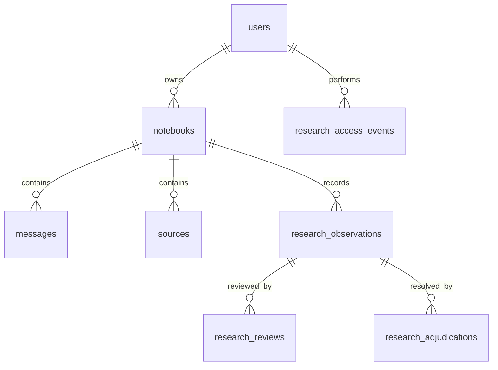
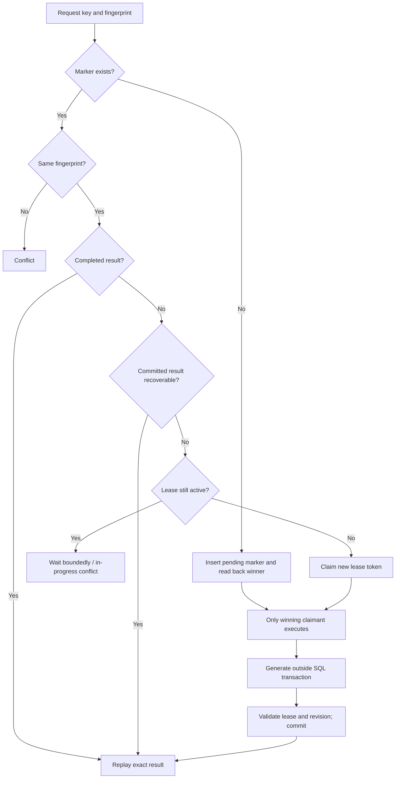

# 4. Database, queries, schema creation, and idempotency

[Handbook index](README.md) · [Next: AgentCore and workflow](05-agentcore-and-workflow.md)

## 4.1 Two database implementations, one application model

Locally the project uses **SQLite**, an embedded SQL database stored in a file. Production uses **Aurora DSQL**, accessed through psycopg and an adaptation layer. These are relational databases: records have columns, identifiers, and relationships. The code does not use DynamoDB as its transcript store.

Structured data stays in SQL; large file bytes stay in object storage. A source row stores an object key such as `users/<owner>/notebooks/<notebook>/sources/<source>/raw/notes.pdf`. That key locates an S3 object in production or a corresponding file through the local adapter. SQL does not need a binary copy of the PDF to manage selection and ownership.

The current schema has **ten tables**, not five. The exact definitions and indexes are included in the [reference](REFERENCE.md), extracted from [SQLite schema](../../backend/persistence/store/sqlite_schema.py) and [DSQL schema](../../backend/persistence/dsql_schema.py).

## 4.2 Every table and why it exists

| Table | Important columns | Purpose and example |
|---|---|---|
| `users` | `id`, `identifier`, `cognito_sub`, `role`, `preferences_text` | Application owner/profile, e.g. a Cognito subject mapped to a student or lecturer |
| `oauth_login_states` | `state`, `code_verifier`, `created_at`, `expires_at` | Short-lived login transaction state; not an application session table |
| `notebooks` | `id`, `user_id`, `current_stage`, `progress_text`, `settings_text`, `conversation_revision` | Root of a student's project conversation and learning state |
| `messages` | `id`, `notebook_id`, `role`, `content`, `assessment_text`, citation/decision fields, revision columns | User/assistant history, decision evidence, and internal request reservation rows |
| `sources` | `id`, `notebook_id`, `kind`, object keys, `selected`, `metadata_text` | Personal/imported source metadata and storage references |
| `research_observations` | user/assistant message IDs, revision, coding/model/prompt versions, phase, evidence fields | Immutable provisional automated research coding linked to a specific turn |
| `research_reviews` | observation ID, reviewer ID, status, coding fields, notes, superseded review ID | Append-only human review of automated coding |
| `research_adjudications` | observation ID, adjudicator ID, decision, referenced review IDs | Append-only resolution of reviewed interpretations |
| `research_access_events` | actor, action, scope, request ID, optional targets and filters | Attributable access audit for protected research operations |
| `system_metadata` | `key`, `value_text`, `updated_at` | System-level workflow compatibility marker |

Fields ending in `_text` often contain JSON serialized into SQL TEXT. For instance, notebook `settings_text` can contain journey checkpoints and review-job state. Flexible JSON-shaped data made it possible to evolve the workflow without adding a column for every pedagogical field. The tradeoff is harder SQL reporting, weaker database-level validation of inner fields, and larger read/modify/write conflicts.

There is no standalone `phase_transitions` table in this schema. Proposed-stage and decision fields, plus internal metadata, represent transition state. Idempotency markers are internal `messages` rows and are filtered out of visible history and counts. Therefore counting every `messages` row is not the same as counting chat bubbles.

## 4.3 Relationships and ownership



The diagram shows logical relationships. SQLite declares foreign keys and cascades in the schema. The DSQL schema omits those constraints, and application code performs ownership validation and ordered deletion. Do not describe this diagram as proof that DSQL enforces every relationship with a foreign key.

For a message, ownership is derived through `messages.notebook_id → notebooks.user_id → users.id`. A client cannot claim ownership by supplying a user ID. The server binds a store/service to the verified owner and checks the parent notebook.

Research observations also reference the original user and assistant messages; automated evidence can be stored as offsets into the student's message rather than duplicate private transcript text. The unique assistant-message observation relationship helps prevent duplicate automated observations for the same completed turn.

## 4.4 How SQL is queried

The store issues SQL through a connection interface. Here is a simplified ownership check matching the code's query shape:

```sql
SELECT id, settings_text, conversation_revision
FROM notebooks
WHERE id = ? AND user_id = ?;
```

The values are passed separately, for example `(thread_id, owner_id)`. They are not concatenated into the SQL string. Binding values prevents user text from becoming SQL syntax. Dynamic table/column names still require controlled code; value placeholders do not authorize arbitrary identifiers.

The DSQL proxy transforms SQLite-oriented `?` placeholders into psycopg `%s` placeholders, preserves quoted literals, and escapes literal percent signs for psycopg. It adapts `INSERT OR IGNORE` to `ON CONFLICT DO NOTHING`; it rejects `INSERT OR REPLACE` because replacement semantics are not safely portable. See [dsql_connection.py](../../backend/persistence/dsql_connection.py).

An illustrative notebook list query is:

```sql
SELECT id, title, current_stage, updated_at
FROM notebooks
WHERE user_id = ?
ORDER BY updated_at DESC;
```

The index on `(user_id, updated_at)` supports that access pattern. Index column order matters: an index beginning with user ID helps find one user's notebooks and then order their activity. It does not automatically optimize every unrelated report.

Active-history retrieval additionally filters internal marker rows and revision visibility. A conceptual revision predicate is:

```sql
conversation_revision <= :active_revision
AND (superseded_at_revision IS NULL
     OR superseded_at_revision > :active_revision)
```

This is explanatory SQL; the store owns the exact predicate and parameter syntax. Ordering by timestamp plus ID provides a deterministic tie-break when timestamps match. Cursor pagination must bind to a conversation revision so an edit cannot splice pages from two incompatible histories.

## 4.5 Indexes are a workload decision

The schema indexes notebook activity, messages by notebook/time/ID, message decision lookups, source ordering, observation queue status, human review history, and audit requests. DSQL also has unique indexes for identity fields and the assistant-to-observation relation.

An index makes matching reads faster at the cost of storage and extra write work. Before adding one, identify the query and its filter/sort pattern. Before saying a query scales, inspect its query plan in the chosen database with realistic row counts. The presence of DSQL does not make a Python loop over every message cheap.

One visible example is `_recorded_coach_turn`: a recovery path selects assistant rows and inspects their metadata for a request key. This is useful for durability compatibility, but large notebooks could make it expensive. A dedicated request table or queryable request-key column is a reasonable future improvement if measurements justify the migration.

## 4.6 How tables are created

**SQLite:** opening the local `StudentStore` initializes its schema and known compatibility migrations. `scripts/init_db.py` is an explicit helper for a chosen database path. It refuses an existing file unless a force option is deliberately used. Schema creation and resetting existing student learning data are different operations.

**DSQL:** the application runtime does not run CREATE/ALTER/INDEX. The administrator runs [init_dsql.py](../../scripts/init_dsql.py), which delegates to [scripts/dsql/cli.py](../../scripts/dsql/cli.py). The script uses admin connection authority, applies one DDL statement per transaction, handles asynchronous index jobs on a dedicated autocommit connection, inspects existing columns, and applies documented additive updates/backfills.

Runtime uses `co_design_app` with DbConnect and data-operation grants. Administrator bootstrap uses DbConnectAdmin. This reduces the chance that ordinary application startup can change the schema.

`CREATE TABLE IF NOT EXISTS` only handles a missing table; it does not automatically upgrade an existing table's columns. That is why catalog inspection and additive ALTER/backfill logic are needed. Index jobs completing is another gate: issuing CREATE INDEX ASYNC is not the same as observing the index ready.

The workflow marker distinguishes compatible five-phase learning data from incompatible old state. A nonempty database without the expected marker is not silently reinterpreted. The explicit reset process inventories data and preserves accounts/auth, with recovery artifacts for SQLite. Do not use reset to hide a failed readiness check.

## 4.7 Transactions and OCC

A transaction groups related SQL changes so they commit together or roll back together. For a normal successful coach turn, the important unit includes the user row, assistant row, assessment/citations, learning metadata, applicable transition state, optional research observation, and exact keyed result when supplied.

The model call happens outside that SQL transaction. Holding a transaction open while waiting for generation would increase conflicts and make retries unsafe. After the model finishes, the transaction checks that the notebook stage/revision and request lease still match the state used for generation.

DSQL uses optimistic concurrency handling in this adapter. “Optimistic” means work proceeds assuming a conflict will be uncommon; at commit, conflicts can require a retry. `run_dsql_transaction` retries the whole database unit for recognized serialization/OCC failures, including SQLSTATE `40001`, with bounded exponential backoff plus jitter. The inspected default is five attempts.

Jitter adds a small random delay so conflicting clients do not all retry at the same instant. A retry callback must contain only operations safe to repeat. Repeating a SQL transaction after rollback is different from repeating a paid model call, sending an email, or uploading an object. External work stays outside the retry callback.

## 4.8 Idempotency, explained with a lost response

Idempotency means repeating the same logical operation does not multiply its intended effect. Suppose Send succeeds on the server, but Wi-Fi drops before the student sees the result. Retrying should recover the completed turn instead of appending a second pair.

The client therefore assigns one **idempotency key** to one logical send. It reuses that key while retrying that send. A genuinely new message gets a new key. A request ID used for logs is a different identifier and may change on each network attempt.

The application computes a **fingerprint**: a SHA-256 digest of normalized request fields. It excludes the retry key and selected server-derived mode fields, and separates Deep Review's operation surface. The digest lets the server detect “same key but different request.” It is not encryption and is not an authorization token.

A deterministic UUID marker ID incorporates owner, notebook, and key. The marker is stored as an internal message with request fingerprint, status, lease token, lease expiry, and eventually the completed turn. Its primary key makes competing claims converge on one row. [Fingerprint code](../../backend/coaching/execution.py) · [Marker lifecycle](../../backend/student_store.py)

## 4.9 The claim/replay state machine



`INSERT ... ON CONFLICT (id) DO NOTHING` is followed by reading the winner. It is not enough to assume “my insert ran, so I own the request.” The returned lease token identifies which worker actually acquired it.

A **lease** is temporary ownership. It makes a crashed request recoverable after expiry. Before committing, the worker must prove it still owns the lease. If another worker reclaimed it, the stale worker cannot overwrite the result. This check is a fencing mechanism: it prevents an old worker's later write from being accepted.

The lease duration is derived from bounded retrieval and provider timeout budgets, plus margin. A short lease could expire during a legitimate long generation, letting another worker spend money on a duplicate call and rejecting the first worker's eventual write.

## 4.10 What guarantees exist—and where they stop

| Situation | Expected behavior |
|---|---|
| Same key, same completed request | Return saved `CoachTurn`; no second durable pair |
| Same key, different fingerprint | Conflict rather than returning an unrelated old answer |
| Same key while owner is still executing | Bounded wait/in-progress handling |
| Worker crashes before generation completes | Lease eventually expires; a retry can reclaim |
| Worker crashes after SQL commit | Recover the durable result or replay the completed marker |
| Old worker returns after lease was reclaimed | Reject its commit |
| Notebook revision changed during generation | Reject stale generation's commit |
| No idempotency key supplied | The submit path can execute without durable keyed replay |
| Two distinct keys for the same text | They represent two operations; same-key deduplication does not merge them |

The last two rows are important. The normal coach request's key is optional in the current application path. Do not say every POST is idempotent. Creation/upload endpoints need their own semantics, and GET is only read-like at the HTTP level—some professor reads intentionally append audit events.

The strongest accurate claim is **durable deduplication of keyed turn effects**, with revision and lease protection. It is not universal exactly-once model execution. A provider can finish and charge while the application crashes before persistence; retrying can call it again. Preventing duplicate SQL rows and preventing every duplicate external charge are different problems.

Also, the deterministic reservation key is per request, not a universal cross-replica lock for every distinct request in a notebook. The current process-local notebook limiter serializes local requests. Adding replicas requires a deliberate cross-process notebook coordination design for different keys, alongside the existing same-key reservation.

## 4.11 Revisions and stale writes

`notebooks.conversation_revision` marks the active branch. Message rows record `conversation_revision`, `previous_message_id`, and `superseded_at_revision`. Editing creates lineage while retaining old content. The edit operation can persist its new user revision before model regeneration succeeds, so it is not identical to the ordinary all-at-once user/assistant commit.

Compare-and-swap means “update only if the expected version still matches.” For example, a worker generated against revision 3; if an edit moves the notebook to revision 4, its commit must fail. Some notebook metadata updates additionally compare the prior `updated_at` to avoid losing concurrent JSON-field updates even when the revision stays the same.

Revision logic must cover conversation memory, research analytics, completion state, and old idempotency keys. Otherwise an apparently correct transcript could still carry stale derived evidence.

## 4.12 SQL and S3 cannot share one local transaction

Deleting a notebook involves SQL rows and objects. The implementation commits database deletion before object-prefix cleanup, with explicit child deletion ordering for DSQL. If object deletion fails, cleanup is retryable; it should not be falsely counted as completed.

This is a distributed consistency problem. There can be orphan objects after a partial failure. A future transactional outbox would save a cleanup task in the same SQL transaction and let a worker retry until completed. That proposal improves reliable cleanup without pretending SQL rollback can undo an already-sent S3 request.

Likewise, a backup strategy must cover both SQL records and referenced objects. Test restore, preserve key relationships, and define recovery time and acceptable data loss. The presence of cloud storage is not evidence that a complete application restore has been rehearsed.
