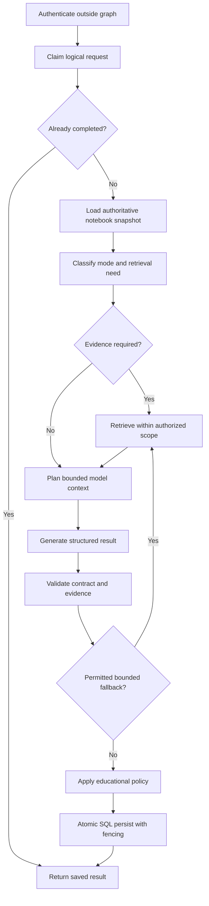

# 6. Running without AWS and extending LangGraph

[Handbook index](README.md) · [Next: scaling and tradeoffs](07-scaling-and-tradeoffs.md)

## 6.1 Removing AWS is not the same as adding LangGraph

AWS supplies hosting, identity, storage, retrieval, and model execution. LangGraph supplies workflow orchestration. Installing LangGraph does not replace a database, object store, login provider, or inference server.

The project already includes `langgraph==1.0.10` in the application requirements. [CoachWorkflow](../../backend/workflow.py) builds this graph:

```text
START → load_context → assess → recommend → format → END
```

`load_context` validates the already-prepared request. It is not the entire retrieval/ownership-loading process. Much of that work happens in `CoachApplicationService` before the graph. `assess` calls the provider and normalizes output. `recommend` applies progression rules and constructs pending transition information. `format` creates `CoachTurn`. Database persistence occurs outside this graph.

The graph uses `StateGraph(dict)` and `MemorySaver`, with a fresh run namespace to separate fallback invocations. A sequential implementation is used if LangGraph cannot be imported. That fallback is deliberately portable.

One method docstring calls the checkpointer durable, but the builder constructs `MemorySaver`. Code establishes the actual behavior: graph checkpoints disappear with process memory. SQL transcript/state persists separately. Official LangGraph documentation makes the same in-memory-versus-persistent distinction. [LangGraph persistence](https://docs.langchain.com/oss/python/langgraph/persistence)

## 6.2 Three realistic non-AWS targets

| Target | Existing support | Missing work |
|---|---|---|
| Deterministic local backend demo | SQLite, local files, mock provider, existing workflow | Full student UI still has a real authentication gate; an offline browser experience needs explicit local identity/product wiring |
| Real model with local data | Existing optional OpenAI adapter plus SQLite/local storage | Credentials and approved model budget; review parity; replacing Cognito for a wholly AWS-free UI |
| Independently hosted production | Reusable FastAPI/UI, retrieval/storage/provider seams | Production PostgreSQL adapter, non-AWS identity, object storage, model adapter, deployment validation and operations |

Mock mode means generation can be deterministic and network-free in tests/backend paths. It should not be advertised as a complete click-through offline browser login when the current Streamlit entrypoint requires a verified Cognito identity. The code intentionally has no general production authentication bypass.

Also, the current production validator requires DSQL and S3. Setting `APP_ENV=development` is not an acceptable shortcut for shipping a new non-AWS production system. Refactor the validator to express security requirements independently of vendor choice, then test the replacement configuration.

## 6.3 What replaces each AWS service?

These are design options, not implemented adapters or verified live deployments.

| Current dependency | Possible non-AWS replacement | Code seam / work |
|---|---|---|
| EC2 | A VM or container host in another environment | Rework deployment/network/health checks; keep app image where compatible |
| ECR | Any compatible container registry | Change image publishing and pull authentication |
| CloudFront | Another TLS reverse proxy/CDN | Preserve WebSockets, auth redirects and public-route policy |
| Cognito | Standards-based OIDC provider | Generalize `CognitoOIDCClient`, claims mapping, refresh/revocation and cookie tests |
| Aurora DSQL | PostgreSQL for concurrent production; SQLite for local use | Implement a proper store adapter/migrations; remove DSQL-specific SQL/IAM assumptions |
| S3 | Local files for one host; another object store for replicas | Implement `FileStorage` operations, safe keys, delete/list semantics |
| Bedrock KB | Course lexical search first, later optional semantic/hybrid index | Implement `ContextRetriever` over a locally ingested authorized course corpus |
| AgentCore Runtime | Generation inside FastAPI or a separate private model service | Implement the same provider/output contract and timeout behavior |
| Bedrock model | Hosted model API or local inference endpoint | Structured-output adapter, prompt/evaluation parity, image support where needed |
| Guardrails | Application moderation and selected provider/local controls | Define equivalent requirements; test attacks/refusals independently |
| CloudWatch | Structured logs and another metrics/tracing backend | Preserve request correlation and privacy-safe fields |

LangGraph and Strands are orchestration libraries; neither has to force the choice of model host. You can keep a constrained invocation abstraction and replace AWS transport. Alternatively, remove Strands from generation if a direct provider API supplies the required validated result. Treat framework choice and model-provider choice as separate decisions.

## 6.4 A staged implementation plan

**Step 1: freeze behavior contracts.** Enumerate `CoachRequest`, `CoachTurn`, source references, progression rules, revision behavior, and review outputs. Build fixtures for ordinary coaching, course Q&A, attachments, missing evidence, invalid model output, and retries. Reuse existing tests before changing transport.

**Step 2: separate pedagogy from hosting.** Canonical AgentCore prompt files contain the current production pedagogy. Package/load those prompts from a provider-neutral module or versioned asset package. Do not assume the existing local prompt path is behaviorally identical merely because both produce `EducationalAssessment`.

**Step 3: implement the generation adapter.** Accept the prepared request and return `ProviderAssessmentResult`. Preserve structured validation, mode rules, source-needed signals, model provenance, and error categories. Keep the provider from owning database writes.

**Step 4: replace official-course retrieval.** Ingest course files into the replacement storage/index. Preserve exact source identity, authorized scope, chunk references, and citation mapping. Virtual S3 catalog rows with no extracted text will not become useful local evidence simply by disabling the KB variable.

**Step 5: replace identity.** Keep OIDC-style verified subject ownership, secure cookies, callback state/PKCE, and staff roles. Define how old user IDs map to new identity subjects so existing notebooks do not become orphaned or assigned to the wrong person.

**Step 6: replace production persistence.** For PostgreSQL, use explicit migrations, preserve IDs/JSON fields/revision lineage, and implement transactional behavior directly. Reusing DSQL's token and compatibility wrapper blindly would preserve unnecessary vendor assumptions. Test duplicate claims with separate connections.

**Step 7: migrate in a controlled rehearsal.** Export a snapshot, copy object bytes with identity/checksum verification, import records in dependency order, and reconcile counts, owners, references, and active revisions. Rehearse on synthetic/redacted data first. Keep a rollback point and decide how writes are frozen during cutover.

**Step 8: verify the entire user flow.** Login, upload/select/cite, chat retry, edit history, movement, lecturer audit, review generation, restart, and restore must work with the replacement services. Passing one model call is not migration completion.

This is a proposed implementation plan only. No adapters, identity mappings, or data migrations were changed while writing the handbook.

## 6.5 A more explicit LangGraph design

If the goal is to see the entire coaching pipeline in a graph, move orchestration boundaries into named nodes while retaining tested service functions.



The loop must carry a remaining-call budget; an error edge cannot repeat forever. A typed graph state could carry owner reference, notebook ID, operation key, revision, lease token, prepared request, retrieval result, provider-attempt count, validated turn, and persisted result ID. Keep secrets out of checkpoint payloads and avoid storing raw file bytes in graph state.

Authentication should remain an HTTP/service boundary. A graph invocation or checkpoint ID is not permission to access a student's notebook. Every resume action must revalidate identity, notebook ownership, and current revision.

## 6.6 What should checkpoints persist?

A persistent checkpointer can record where an execution stopped, while application SQL records what the user actually submitted and what committed. These two stores must have a clear authority relationship. Avoid treating a checkpointed model result as a durable chat turn before the SQL commit succeeds.

For this project, a reasonable proposal is to keep the application database authoritative for transcript, revision, and operation result. Checkpoints hold execution progress plus references to those durable records. If a node reruns after a crash, it first checks whether its side effect already committed.

A PostgreSQL checkpointer is a possible replacement for `MemorySaver`, but the project's pinned LangGraph version and checkpoint-package versions must be tested together. Do not copy current documentation examples into a pinned older environment without a compatibility check. The existing graph's fresh namespace per invoke also needs redesign if long-lived resume is desired.

## 6.7 Should student stage confirmation use an interrupt?

LangGraph supports pausing a graph with `interrupt()` and resuming it with `Command(resume=...)` using the same thread/checkpoint identity. Resumption restarts the node, so effects before the interrupt must be safe to repeat. [LangGraph interrupts](https://docs.langchain.com/oss/python/langgraph/interrupts)

For this application, an interrupt is optional. The current design can finish a chat turn, store a recommendation, and wait for a later stage-selection API request. This naturally supports students continuing to chat before moving.

If you choose interrupts, first persist the answer/recommendation idempotently, expose a pending approval token, and validate the student's resume request against owner, revision, and pending recommendation. Never let a model-created checkpoint be the only source of progression authority. Avoid blocking all subsequent chat just because a recommendation is pending unless that is an intentional product decision.

## 6.8 How to migrate orchestration safely

Start with a graph that calls existing pure/service helpers, preserving their boundaries. Compare old and new outputs with the same mock fixtures. Then introduce persistent checkpointing and simulate restart at each node boundary. Finally test concurrent resumes and lost-response retries.

Do not initially combine framework migration, model change, retrieval algorithm change, and new pedagogy. If all four change together, a quality regression becomes difficult to attribute. A graph is useful when it clarifies branching, observability, and recovery; adding more nodes for their own sake does not improve the product.

## 6.9 Fully local inference considerations

A local model endpoint removes hosted generation dependency but introduces hardware and operations work: model memory, throughput, concurrent requests, structured-output reliability, image support, model licensing, and upgrades. A small origin VM suitable for HTTP coordination is not automatically suitable for serving model weights.

Keep the deterministic mock provider for regression tests even after adding a real local model. Use a separate evaluation run to compare reasoning quality, groundedness, refusal behavior, phase consistency, and time to completed answer. The alternative is successful only if it preserves the learning behavior and data guarantees, not merely because it runs without AWS.
